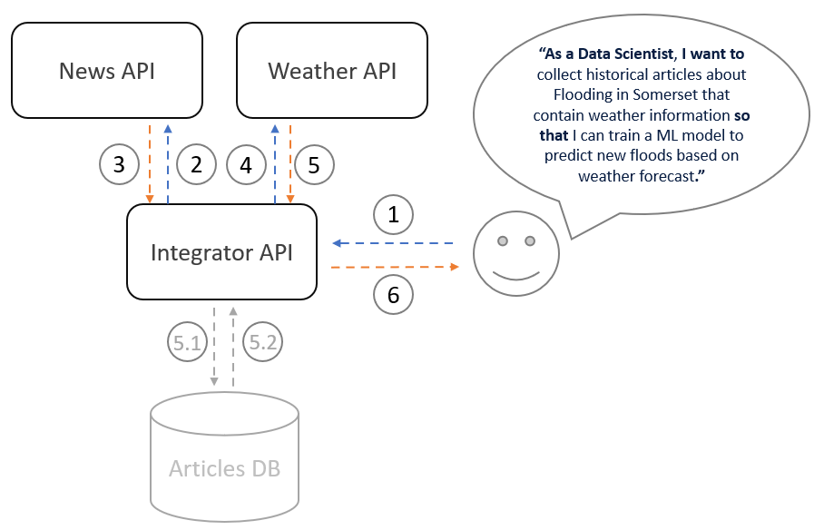
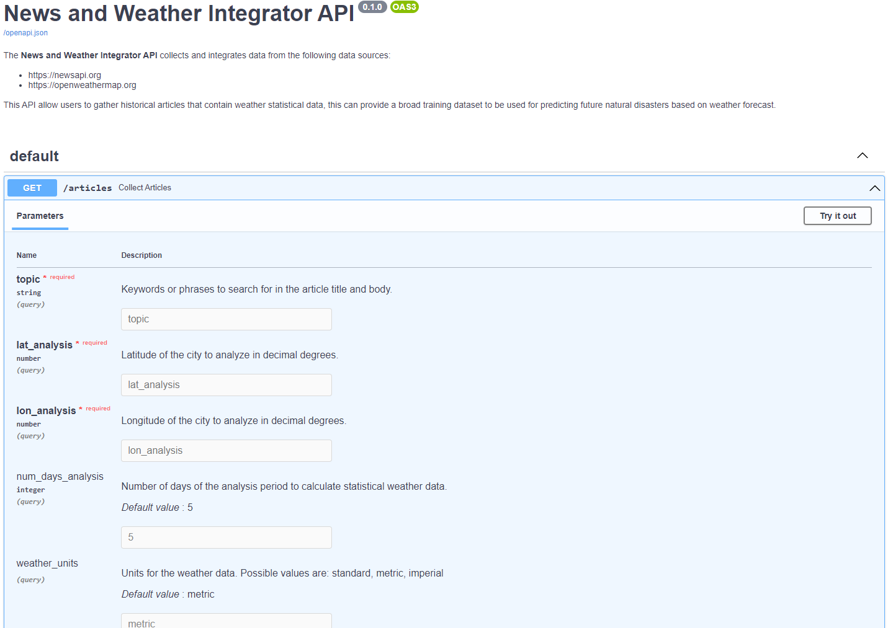

# News and Weather Integrator
This project proposes an `ETL` pipeline to collect and integrate data from the `OpenWeatherMap API` and `NewsAPI` data sources:

- **OpenWeatherMap API** (https://openweathermap.org/api)

    API docs: https://openweathermap.org/history#city

- **NewsAPI** (https://newsapi.org/)

    API docs: https://newsapi.org/docs/endpoints

The pipeline will allow end users to gather historical articles that contain weather statistical data, this can provide a broad training dataset to be used for predicting future natural disasters based on weather forecast.


## Solution design

The pipeline is designed in a modular way and can be used to solve different use cases. For the purpose of explaining the different steps I will present a particular use case, although other use cases are listed in the [other use case](#other-use-cases) section.

`USER STORY`:

**“As a `Data Scientist`, I want to collect historical articles about Flooding in Somerset that contain weather information so that I can train a ML model to predict new floods based on weather forecast.”**

The following image shows the pipeline workflow:



1. The `end user` makes an API call to request data related to `flooding in Somerset`.

2. The `Integrator` application calls the `NewsAPI` to fetch recent articles related to `flooding in Somerset`.

3. The data is sent back to the `Integratior` application. For each of the articles collected, the `published` time is extracted.

4. For each of the articles collected, the `Integrator` application calls the `WeatherAPI` to request weather data. This will return data for a window analysis, with `end time` being the published date of the article, and `start time` a number of days before the article was published (the number of days is set by the user).

5. The weather data is sent back to the application. Statistics on the weather data are performed for each analysis period (that relates to a particular article) and integrated with the corresponding article.

6. The data is sent back to the user.


**Not implemented in the source code:**

5.1. The data could be stored in a data base and run the pipeline on schedule to collect real time data and provide a wider dataset to the user. 

5.2. The data could be sent back to the application based on filtering and sortering parameters.

## How the application interacts with the APIs
Both APIs have python client libraries:
- **News API**: https://newsapi.org/docs/client-libraries/python
- **Weather**: https://pyowm.readthedocs.io

However, the application is using `requests` library.

## Other use cases
- Market studies for the use of renewable energies in different locations.
- Study of climate change and how humans are having an impact on it.
- Predict electricity prices as weather conditions, particularly temperature fluctuations, can influence energy prices.


## Get started
1. Create a virtual environment for this project with:
    ```
    python -m venv venv
    ```
2. Activate the virtual environment
- For windows users:
    ```
    .\venv\Scripts\activate
    ```
- For Linux / mac users:
    ```
    source venv/bin/activate
    ```
3. Install the required dependencies for this project from the `requirements.txt`

4. Set `api keys` as environment variables

- For Windows users:

    Create a `.env.sh` file and add the following api keys:
    ```
    set WEATHER_API_KEY=
    set NEWS_API_KEY=
    ```
    Run the file with:
    ```
    .env.bat
    ``` 

- For Linux users:

    Create a `.env.sh` file and add the following api keys:
    ```
    export WEATHER_API_KEY=
    export NEWS_API_KEY=
    ```
    Run the file with:
    ```
    source .env.sh
    ``` 

## Run the application
```shell
python main.py
```

## OpenAPI documentation
Access ` http://127.0.0.1:8000/docs` to see the interactive API documentation.


## Examples
```http
    GET http://localhost:8000/articles    
```
- ### **Extreme heat in Spain**
    This example provides a collection of articles related to recent extream heat in Spain with statistical weather data.
    
    **Query parameters**:

    `topic` = extreme heat Spain

    `lat_analysis` = 40.4637

    `lon_analysis` = -3.703

    `num_days_analysis` = 5

    `weather_units` = metric

    [Link to the http example](examples/extreme_heat_spain.http)

- ### **Flooding in Somerset**
    This example provides a collection of articles related to recent flooding in somerset with statistical weather data.

    **Query parameters**:

    `topic` = Somerset flooding

    `lat_analysis` = 50.18

    `lon_analysis` = -3.0

    `num_days_analysis` = 5

    `weather_units` = metric

    [Link to the http example](examples/flooding_somerset.http)

- ### Storms in California
    This example provides a collection of articles related to recent storms in California with statistical weather data.

    **Query parameters**:

    `topic` = California storms

    `lat_analysis` = 36.778259

    `lon_analysis` = -119.417931

    `num_days_analysis` = 5

    `weather_units` = metric

    [Link to the http example](examples/storms_california.http)

## Tests
Yet to be implemented.